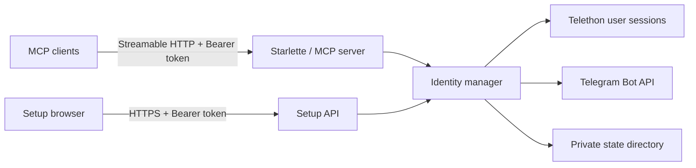

# Architecture

TG multi-account MCP is one asynchronous Python process with four external boundaries:

## Components

- `cli.py` owns local administration, process startup, credential creation, and token rotation.
- `web.py` serves the static dashboard and authenticated setup API.
- `server.py` defines MCP tools, authorization checks, idempotent writes, and sanitized errors.
- `manager.py` owns account/bot lifecycle and isolates failures to one identity.
- `telegram.py` adapts Telethon operations to the server's stable data contracts.
- `bot.py` contains the small Telegram Bot API boundary.
- `storage.py` validates permissions and performs atomic writes in the state directory.
- `access.py` resolves the main token and scoped agent-token permissions.
- `telemetry.py` retains bounded operation metadata for the dashboard.

## State

`credentials.json` contains the Telegram API credentials and main MCP token. User account sessions
are stored independently so one expired or revoked session does not prevent other identities from
starting. Bot records, agent token hashes, drafts, idempotency receipts, and the bounded operations
history are stored as private JSON files.

The application requires a single writer. Files are atomically replaced, but the state model is
not a distributed database and one state volume must not be mounted by multiple replicas.

## Trust boundaries

Telegram content is untrusted input. It is returned as data and must not be interpreted as an
instruction by an agent. Tool arguments are validated before reaching Telegram, and upstream
exception text is not returned to clients. Authentication is checked for every setup and MCP
request; tool-level authorization then checks scope, identity, and chat restrictions.

The dashboard uses bundled static assets and a restrictive Content Security Policy. In the
Compose deployment, Caddy is the public network boundary and the Python service remains on the
internal network.

## Testing

The test suite uses fake Telegram and bot adapters while exercising the real MCP SDK and local
HTTP stack. This verifies protocol shapes, authentication, permissions, pagination, onboarding,
and error behavior without reading or sending through a real Telegram account.
